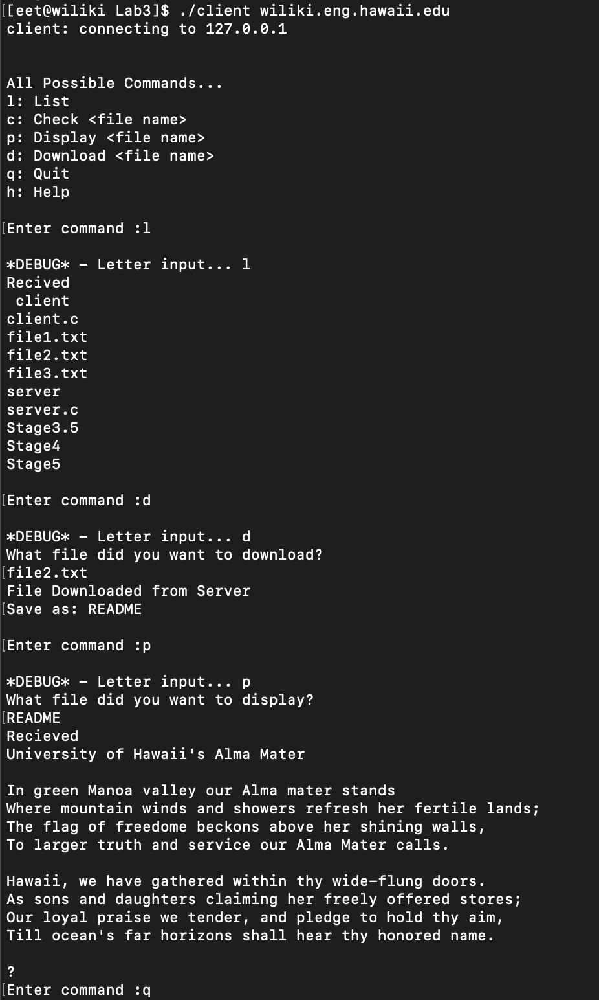
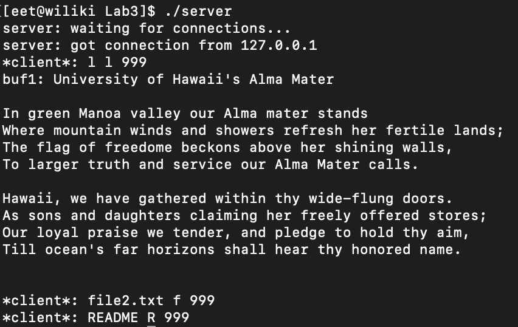
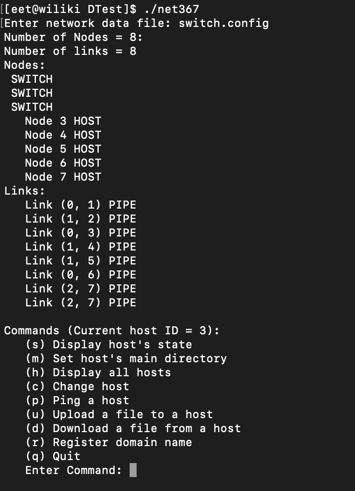
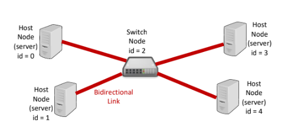

  
  
  

In this project, I worked in a team of 4 to design and improve a Network LAN Simulator. Initially, the Network LAN Simulator worked by creating a server and a client that were able to send packets back and forth in order to upload, download, and view files in the server. However, the next improvement in the project was to allow a switch node be used in order to allow multiple servers to communicate back and forth as both the client and server. This would allow multiple servers to download, upload, and view each others files using domain names instead of direct IP addresses. The set up in a physical sense would look like the image provided below.

  

My main contribution to this would be to create the switch node that allowed the servers to communicate back and forth. I would not work on any of the individual functions like uploading, downloading, or registering domain names, rather I would work on how to get the servers to communicate with each other effectively.

During this project, I learned how to work in a group and how to manage my time in order to meet deadlines. We elected a project manager that was in charge of making sure each section of our code was being developed in a timely manner. In a addition to that, I learned how to modify previously written code. The project took code that already had developed functions and was asked to use those functions to make the desired outcome possible.  

The source code can be found at: https://github.com/Justicam/EE367L-Lab5
