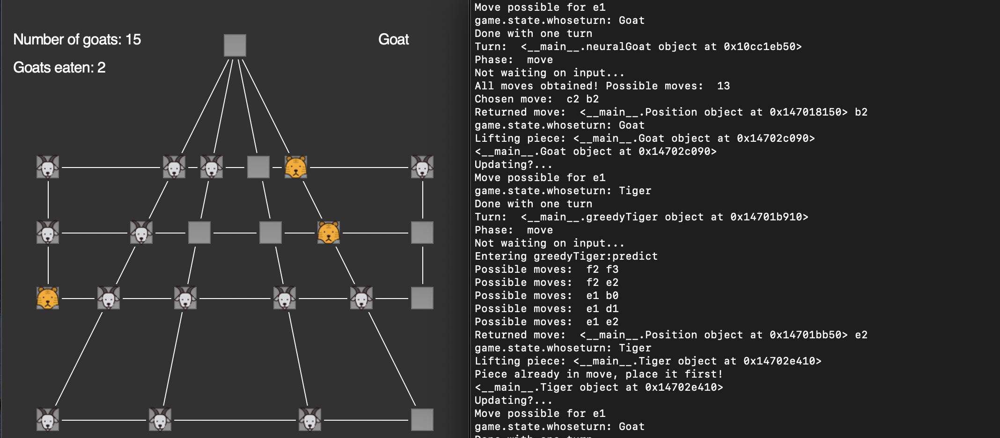

In this project, machine learning techniques were applied to gaming strategies to improve the AI's performance in the traditional game Tigers and Goats. The primary goal was to develop the AI to become more efficient against real-life opponents. This was done by training the AI on various gameplay scenarios to improve its overall gameplay. 

During this project, my contribution was limited to a couple small functions helping with capturing of goats in the game. My contribution was limited since my main role in this project was to be mentored and learn from others with more experience than myself. I attended meeting and learned about the various functions and processes that the code contained.

The main things I learned during this experience was how math works with machine learning and how you can get your expected results using math and analysis along with coding. I learned what it takes to create a large scale application and how to organize people into groups so the outcome can be achieved in a reasonable timeframe.
