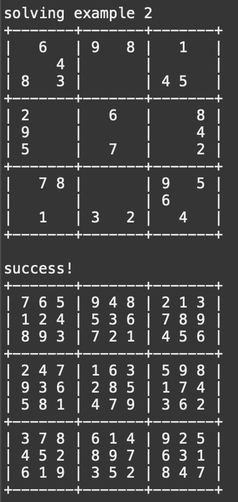

  

In this project, I used Java in order to find a solution to any given Sudoku problem. This was achieved by using backtracking and recursion. The main concept of how the program works is by slowly filling each cell with a legal value till there is either a solution or there is a problem along the way. Once a problem is discovered it will backtrack and try other possible legal values until a solution is found. Once a solution is found it is tested to make sure the solution is correct and follows the rules of Sudoku.
