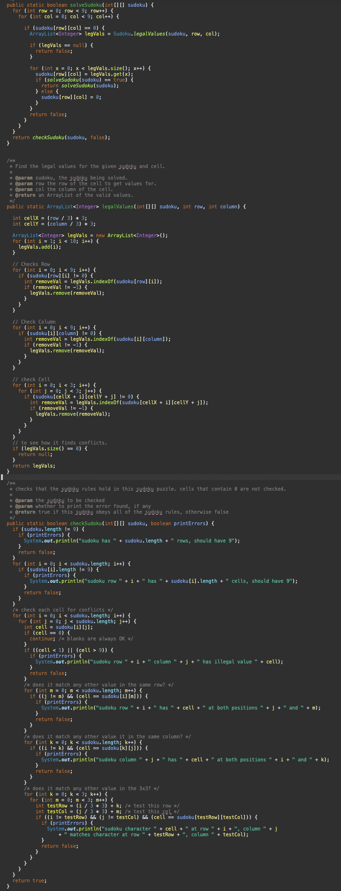

  

This project tackled the idea of how to solve sudoku puzzles. Computers unlike humans have the benefit of being fast when running simulations and attempting problems. This allows for computers to use trial and error when humans would only be wasting their time by using this method. Using the method of trial and error, I used recursion in java in order to make a program that can solve sudoku puzzles using trial and error.

This was achieved by using backtracking and recursion. The main concept of how the program works is by slowly filling each cell with a legal value till there is either a solution or there is a problem along the way. Once a problem is discovered it will backtrack and try other possible legal values until a solution is found. Once a solution is found it is tested to make sure the solution is correct and follows the rules of Sudoku.

Since this was a solo project, most of the main code was developed by me. The main thing I learned during this experience was how to approach problems and how recursive functions work. I learned how to make appropriate base case functions along with optimal recursive functions. The code is depicted below in the picture.

  

